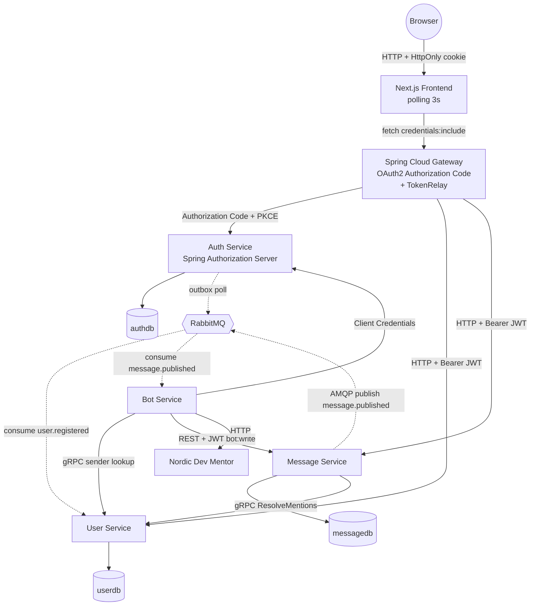

# Devroom

Distributed chat with **@-mentionable AI mentors** built on a microservice architecture.
Five Spring Boot services + a Next.js frontend, talking over REST, gRPC, and RabbitMQ,
secured with OAuth2 + JWT, and deployable on Kubernetes via Minikube.

See [design spec](docs/superpowers/specs/2026-05-10-devroom-design.md) for the full design.

## Status

All ten plans complete; DevOps-utbyggnad pågår (Fas A–D: Helm → Traefik → observability → CI/CD → AWS).

| # | Komponent | Plan | Klar |
|---|---|---|---|
| 1 | Repo bootstrap (parent POM, proto, compose, CI, ADR-0001) | 01 | 2026-05-13 |
| 2 | Auth Service (Spring Authorization Server 7.0.5) | 02 | 2026-05-14 |
| 3 | User Service (Spring gRPC 1.0.3 + JPA) | 03 | 2026-05-14 |
| 4 | RabbitMQ-wiring (`user.registered`-flödet) | 04 | 2026-05-16 |
| 5 | Message Service (POST/GET, gRPC-klient, `message.published`) | 05 | 2026-05-18 |
| 6 | Gateway (Spring Cloud Gateway 5.0.1 WebMVC, OAuth2 + TokenRelay) | 06 | 2026-05-20 |
| 7 | Bot Service (RabbitMQ-consumer + Client Credentials + Nordic Dev Mentor) | 07 | 2026-05-20 |
| 8 | Frontend (Next.js 16, Tailwind 4, cookie-baserad auth) | 08 | 2026-05-20 |
| 9 | Cross-service contract test → superseded by Plan 10's full e2e | 09 | 2026-05-20 |
| 10 | Kubernetes deploy (Dockerfiles + 14 K8s-manifest + deploy.sh + ADR-0009) | 10 | 2026-05-21 |
| 11 | Helm-chart (generisk service-mall + infra-toggle + ADR-0010) | 11 | 2026-06-24 |
| 12 | Traefik ingress (CoreDNS split-horizon + ADR-0011) | 12 | 2026-06-24 |
| 13 | Metrics: Prometheus + Grafana (ServiceMonitor + egna counters + ADR-0012) | 13 | 2026-06-24 |
| 14 | Loggar: Loki + Alloy + strukturerad JSON (ADR-0013) | 14 | 2026-06-27 |
| 15 | Tracing: Tempo + Micrometer (OTLP via Alloy + ADR-0014) | 15 | 2026-07-15 |

## Arkitektur



Fem backend-services + Next.js-frontend, RabbitMQ för events, gRPC för intern
read-trafik, JWT (RS256) för autentisering, outbox-pattern för signup,
deployas på Kubernetes via Minikube.

## Snabbstart

### Lokalt utan K8s (Docker Compose, hela stacken)

```bash
docker compose --profile full up --build
# Öppna http://localhost:3000
```

Default-profilen `docker compose up` startar bara infra (Postgres × 3 + RabbitMQ)
— användbart om du vill köra services lokalt via `mvn spring-boot:run` mot riktig infra.

> **Caveat:** Browser-OAuth-flödet (Authorization Code-redirect till auth-service)
> kräver att host-OS:et kan resolva `auth-service` till `127.0.0.1`. Lägg till
> raden `127.0.0.1 auth-service` i `/etc/hosts` om du vill testa full inloggning
> via compose. Service-till-service-flöden (Client Credentials, JWKS, gRPC)
> fungerar utan editen. K8s-deployen via port-forward har inte detta problem.

### På Minikube (Kubernetes)

```bash
minikube start --driver=docker --memory=6144 --cpus=4
bash k8s/deploy.sh

# I separata terminaler eller med & i bakgrunden:
kubectl port-forward -n devroom svc/frontend     3000:3000 &
kubectl port-forward -n devroom svc/gateway      8080:8080 &
kubectl port-forward -n devroom svc/auth-service 8081:8081 &
kubectl port-forward -n devroom svc/rabbitmq    15672:15672 &

# Öppna http://localhost:3000
# RabbitMQ management: http://localhost:15672 (devroom/devroom)
```

`deploy.sh` bygger 7 images direkt i Minikubes Docker daemon, applicerar
14 K8s-manifest i rätt ordning, och väntar på readiness mellan stegen.

Tear-down: `kubectl delete namespace devroom`.

### På Minikube med Helm (rekommenderat)

De råa manifesten är paketerade som ett Helm-chart (`helm/devroom`, se
[ADR-0010](docs/adr/0010-helm-vs-kustomize.md)). Samma chart deployar till både
Minikube och senare EKS genom att byta `values`.

```bash
minikube start --driver=docker --memory=6144 --cpus=4
bash helm/deploy.sh           # bygger 7 images + helm upgrade --install

# Bot-svar kräver en LLM-nyckel (annars startar allt men boten svarar 503):
#   OPENROUTER_API_KEY=sk-... bash helm/deploy.sh
```

`helm/deploy.sh` bygger imagesarna i Minikubes Docker och kör
`helm upgrade --install devroom helm/devroom -n devroom --create-namespace`.
Port-forward-kommandona skrivs ut i NOTES efter install. Tear-down:
`helm uninstall devroom -n devroom`.

> Migrerar du från en tidigare rå `k8s/deploy.sh`-deploy: kör först
> `kubectl delete namespace devroom` — Helm tar inte över objekt den inte själv skapat.

### Ingress med Traefik (rekommenderad åtkomst)

Ersätter port-forward med en riktig ingress (se [ADR-0011](docs/adr/0011-traefik-ingress.md)).
Hela stacken nås via `http://devroom.local`, och browser-login fungerar end-to-end —
issuern (`http://auth.devroom.local`) är samma URL i browsern och i klustret tack vare en
CoreDNS split-horizon-rewrite.

```bash
bash helm/setup-ingress.sh    # FÖRST: installerar Traefik + patchar CoreDNS
bash helm/deploy.sh           # SEN: deploya appen (når issuern från start)

echo "127.0.0.1 devroom.local auth.devroom.local" | sudo tee -a /etc/hosts
minikube tunnel               # eget terminalfönster, kräver sudo

# Öppna http://devroom.local — login fungerar utan port-forward
```

### Metrics med Prometheus + Grafana

Se [ADR-0012](docs/adr/0012-kube-prometheus-stack.md). De 5 Spring-tjänsterna exponerar
`/actuator/prometheus`; kube-prometheus-stack skrapar dem via en ServiceMonitor, och Grafana
visar en "Devroom Overview"-dashboard inkl. egna mått `messages_published_total` och
`bot_replies_total`. Kräver Minikube med minst 8 GB.

```bash
minikube start --driver=docker --memory=8192 --cpus=4
bash helm/setup-ingress.sh      # Traefik + CoreDNS (incl. grafana-host)
bash helm/install-monitoring.sh # kube-prometheus-stack + Grafana-ingress
bash helm/deploy.sh             # appen (ServiceMonitor + dashboard)

echo "127.0.0.1 grafana.devroom.local" | sudo tee -a /etc/hosts
minikube tunnel                 # eget fönster
# Grafana: http://grafana.devroom.local  (admin/admin)
```

### Loggar med Loki

Se [ADR-0013](docs/adr/0013-loki-alloy-logging.md). Tjänsterna loggar strukturerad
ECS-JSON; Grafana Alloy (DaemonSet) samlar containerloggarna och pushar till Loki.
Loggarna frågas i Grafana → Explore (datakälla Loki) och syns i en panel i
"Devroom Overview".

```bash
bash helm/install-monitoring.sh  # Plan 13 (om inte redan kört)
bash helm/install-logging.sh     # Loki + Alloy + Grafana-datakälla
bash helm/deploy.sh              # appen (JSON-loggar + logs-panel)
# Grafana → Explore → Loki:  {namespace="devroom"} | json | log_level="ERROR"
```

### Tracing med Tempo

Se [ADR-0014](docs/adr/0014-tempo-tracing.md). Tjänsterna instrumenteras med Micrometer
Tracing och exporterar OTLP till Grafana Alloy, som vidarebefordrar till Tempo. En trace
följer ett request genom HTTP → gRPC → RabbitMQ och visas som ett waterfall i Grafana →
Explore (datakälla Tempo), med hopp till Loki-loggar per span.

```bash
bash helm/install-monitoring.sh   # Plan 13
bash helm/install-logging.sh      # Loki + Alloy + Tempo
bash helm/deploy.sh               # appen (instrumenterad)
# Grafana → Explore → Tempo → sök en trace → waterfall över alla transporter
```

### Komponenter under utveckling lokalt

```bash
mvn -B verify                                     # build + test alla moduler
mvn -pl services/auth-service spring-boot:run     # Auth Service :8081
mvn -pl services/user-service spring-boot:run     # User Service :8082 + gRPC :9082
mvn -pl services/message-service spring-boot:run  # Message Service :8083
GATEWAY_CLIENT_SECRET=dev-gateway-secret-change-me \
  mvn -pl services/gateway spring-boot:run        # Gateway :8080
BOT_CLIENT_SECRET=dev-bot-secret-change-me \
  mvn -pl services/bot-service spring-boot:run    # Bot Service :8084
cd frontend && npm install && npm run dev         # Next.js :3000
```

Bot Service kräver också Nordic Dev Mentor (`~/IdeaProjects/dev-mentor`) startad
med `SERVER_PORT=8090 mvn spring-boot:run` så den inte kolliderar med Gateway.

## Demo-flow

1. Öppna `http://localhost:3000`
2. Klicka **Sign up**, fyll i email + lösenord
3. Du redirectas via Authorization Code-flödet och landar inloggad i chatten
4. Posta `@code-reviewer kan du förklara dependency injection?` i en kanal
5. Inom ~3-8 sekunder ger Bot Service ett svar — kolla `kubectl logs -n devroom -f deploy/bot-service` för att se Client Credentials-tokens, gRPC-lookup och dev-mentor-anropet flyta förbi

## Tjänster

| Service | Port | Roll |
|---|---|---|
| **Gateway** | 8080 | Edge / BFF — OAuth2 Authorization Code, cookie-session, TokenRelay nedströms |
| **Auth Service** | 8081 | Spring Authorization Server, signup, JWT, JWKS |
| **User Service** | 8082 HTTP, 9082 gRPC | Profiler, mentor-uppslag, mention-resolution |
| **Message Service** | 8083 | POST/GET messages, mention-resolution via gRPC, `message.published`-publisher |
| **Bot Service** | 8084 | RabbitMQ-consumer, Client Credentials, wrappar Nordic Dev Mentor |
| **Frontend** | 3000 | Next.js 16 / React 19 / Tailwind 4, cookie-baserad auth |
| **Nordic Dev Mentor** | 8090 | Extern AI-service (svart låda — se [dev-mentor repo](https://github.com/annikaholmqvist94/nordic-dev-mentor)) |

## Arkitekturbeslut

Se [docs/adr/](docs/adr/) för fullständig lista.

- **[ADR-0001](docs/adr/0001-microservice-decomposition.md)** — fem backend-services + en frontend, bounded contexts
- **[ADR-0002](docs/adr/0002-outbox-pattern.md)** — transactional outbox för `user.registered`
- **[ADR-0003](docs/adr/0003-oauth2-stack.md)** — Spring OAuth2-stack över Kong + handskriven JWT
- **[ADR-0004](docs/adr/0004-grpc-vs-rest.md)** — gRPC för intern read-trafik, REST för writes
- **[ADR-0005](docs/adr/0005-no-cross-db-foreign-keys.md)** — inga foreign keys över databasgränser
- **[ADR-0006](docs/adr/0006-grpc-starter-spring-grpc.md)** — Spring gRPC 1.0.3 över `net.devh`
- **[ADR-0007](docs/adr/0007-gateway-webmvc-variant.md)** — Spring Cloud Gateway WebMVC-variant
- **[ADR-0008](docs/adr/0008-bot-service-restclient-oauth2.md)** — Bot Service RestClient + interceptor över WebClient + filter
- **[ADR-0009](docs/adr/0009-minikube-port-forward.md)** — Minikube + port-forward över ingress controller

## Designdokument

- [Design spec](docs/superpowers/specs/2026-05-10-devroom-design.md) — 15 sektioner från arkitektur till deployment
- [Planer](docs/superpowers/plans/) — 10 implementations-planer (en per fas)

## Out of scope

DM, refresh-tokens i frontend, multi-team, avatar-upload, WebSockets, mTLS,
HA-Postgres, RabbitMQ-clustering, ingress controller, cloud-deployment.
Allt dokumenterat i designspec sektion 15.
